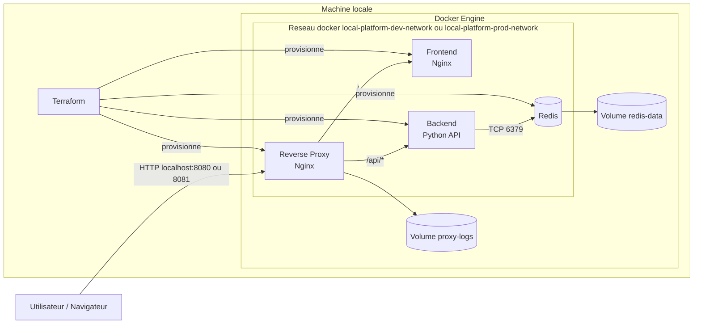

# local-platform

Mini plateforme locale gérée par Terraform et Docker, pensée comme un petit projet d'entreprise plutôt qu'une simple démo.

## Objectif

Ce projet montre comment organiser un dépôt d'infrastructure simple mais crédible, avec :

- un provider Docker piloté par Terraform
- un module réutilisable
- une séparation `dev` / `prod`
- des conventions de nommage cohérentes
- des dépendances explicites entre services
- des volumes persistants
- des healthchecks
- une documentation d'exploitation

## Services déployés

- un reverse proxy Nginx en entrée
- un frontend Nginx statique
- un backend Python minimal exposant `/api/info` et `/healthz`
- un cache Redis avec volume persistant
- un réseau Docker dédié partagé par tous les services

## Structure

```text
.
├── docker
│   ├── backend
│   ├── frontend
│   └── reverse-proxy
├── env
│   ├── dev.tfvars
│   └── prod.tfvars
├── modules
│   └── local_platform
├── main.tf
├── outputs.tf
├── providers.tf
└── variables.tf
```

## Schema d'architecture



Flux principal :

- l'utilisateur entre par le reverse proxy
- le reverse proxy route `/` vers le frontend
- le reverse proxy route `/api/*` vers le backend
- le backend utilise Redis sur le reseau Docker commun
- Redis et les logs Nginx sont persistés dans des volumes Docker
- Terraform cree et relie l'ensemble des ressources

## Prérequis

- Docker installé et démarré
- Terraform 1.5+ installé localement

## Demarrage rapide

Initialiser le projet :

```bash
terraform init
```

Previsualiser l'environnement de developpement :

```bash
terraform plan -var-file=env/dev.tfvars
```

Creer la plateforme :

```bash
terraform apply -var-file=env/dev.tfvars
```

Acceder a la plateforme :

- reverse proxy : `http://localhost:8080`
- frontend direct : `http://localhost:18080`
- backend direct : `http://localhost:18081/api/info`
- redis local : `localhost:16379`

## Environnements

`dev`

- expose le reverse proxy, le frontend, le backend et Redis sur l'hote
- facilite les tests et le debug local

`prod`

- n'expose que le reverse proxy
- simule un environnement plus ferme, proche d'une cible interne

Commande pour la variante `prod` :

```bash
terraform apply -var-file=env/prod.tfvars
```

URL de la variante `prod` :

- reverse proxy : `http://localhost:8081`

## Documentation

- guide d'exploitation : [docs/OPERATIONS.md](docs/OPERATIONS.md)
- documentation d'architecture : [docs/ARCHITECTURE.md](docs/ARCHITECTURE.md)

## Points pédagogiques couverts

- provider Docker
- modules Terraform
- conventions de nommage
- séparation `dev` / `prod`
- dépendances entre ressources
- gestion de variables
- organisation d'un repo infra
