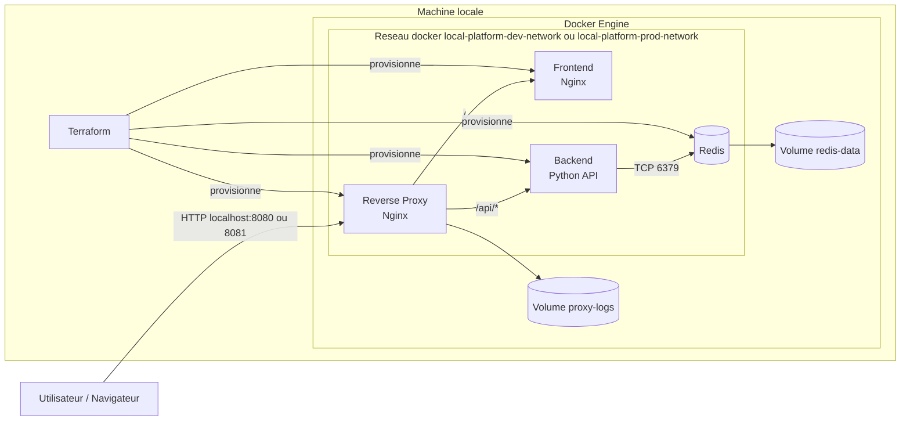

# local-platform

Mini plateforme locale gérée par Terraform et Docker, pensée comme un petit projet d'entreprise plutôt qu'une simple démo.

## Ce que le projet met en place

- un réseau Docker dédié partagé par tous les services
- un frontend Nginx statique
- un backend Python minimal exposant `/api/info` et `/healthz`
- un reverse proxy Nginx en entrée
- un cache Redis avec volume persistant
- des variables par environnement avec `env/dev.tfvars` et `env/prod.tfvars`
- un module réutilisable dans `modules/local_platform`
- des outputs propres pour les noms de containers, le réseau, les volumes et l'URL
- des healthchecks sur chaque service

## Structure

```text
.
├── docker
│   ├── backend
│   ├── frontend
│   └── reverse-proxy
├── env
│   ├── dev.tfvars
│   └── prod.tfvars
├── modules
│   └── local_platform
├── main.tf
├── outputs.tf
├── providers.tf
└── variables.tf
```

## Schema d'architecture



Flux principal :

- l'utilisateur entre par le reverse proxy
- le reverse proxy route `/` vers le frontend
- le reverse proxy route `/api/*` vers le backend
- le backend utilise Redis sur le reseau Docker commun
- Redis et les logs Nginx sont persistés dans des volumes Docker
- Terraform cree et relie l'ensemble des ressources
## Prérequis

- Docker installé et démarré
- Terraform 1.5+ installé localement

## Déploiement local

Initialiser le provider :

```bash
terraform init
```

Prévisualiser l'environnement de développement :

```bash
terraform plan -var-file=env/dev.tfvars
```

Créer la plateforme :

```bash
terraform apply -var-file=env/dev.tfvars
```

Accéder à la plateforme :

- reverse proxy : `http://localhost:8080`
- frontend direct : `http://localhost:18080`
- backend direct : `http://localhost:18081/api/info`
- redis local : `localhost:16379`

Déployer la variante prod :

```bash
terraform apply -var-file=env/prod.tfvars
```

La variante `prod` n'expose que le reverse proxy, sur `http://localhost:8081`.

## Exploitation

Lister les ressources créées :

```bash
terraform state list
```

Voir les outputs utiles :

```bash
terraform output
```

Inspecter les containers :

```bash
docker ps --format 'table {{.Names}}\t{{.Status}}\t{{.Ports}}'
```

Vérifier la santé applicative :

```bash
curl http://localhost:8080/healthz
curl http://localhost:8080/api/info
```

Vérifier Redis :

```bash
docker exec -it local-platform-dev-redis redis-cli ping
```

Détruire l'environnement :

```bash
terraform destroy -var-file=env/dev.tfvars
```

## Points pédagogiques couverts

- provider Docker
- modules Terraform
- conventions de nommage
- séparation `dev` / `prod`
- dépendances entre ressources
- gestion de variables
- organisation d'un repo infra
